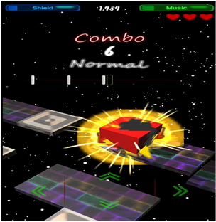
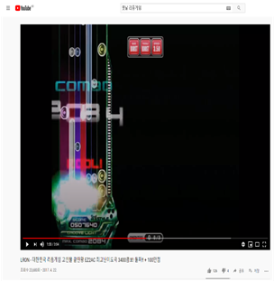
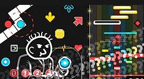
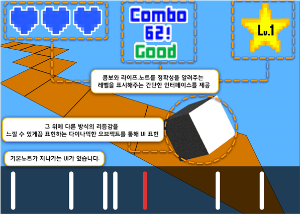

# [컨셉]
## 메인컨셉 : Reaction
- 유저의 입력에 따라 역동적인 리액션을 보여주도록 하자.

### 서브 컨셉 1 : Rhythm
- 리듬게임에 기반하여 타이밍(노트)을 만들자.

### 서브 컨셉 2 : Simple
- 인터페이스, 입력키는 최대한 간단하게 만들어 접근성을 높히자.

### 서브 컨셉 3 : Score
- 점수시스템을 만들어서 경쟁심과 도전정신을 유도하자.

### 서브 컨셉 4 : Visual
- 유저에 입력에 반응하는 화려한 시각적 효과를 만들자.

### 서브 컨셉 5 : Taste
- 유저의 다양한 니즈에 맞추어 여러개의 노래풀을 만들자.

  
# [관련 이미지 & 동영상]
- 이미지  

- 동영상
      

  
# [대표 이미지]
  

  
# [컨셉 & 대표이미지 기반 작품묘사]
> ### 대표이미지 기반 :

> ### 컨셉 기반:

  
# [<게임제목> 구성 요소]

- 가나다라마바사아차카타파하 가나다라마바사아차카타파하

 

## 1. 메커니즘

[도전 과제]
1) 가나다라마바사아차카타파하
2) 가나다라마바사아차카타파하

[재미 요소]
1) 가나다라마바사아차카타파하
2) 가나다라마바사아차카타파하

 

## 2. 이야기

[만들게 된 배경]  
가나다라마바사아차카타파하 가나다라마바사아차카타파하

[카메라 관점]  
가나다라마바사아차카타파하 가나다라마바사아차카타파하

 

## 3. 미적요소

[디자인][컬러]  
가나다라마바사아차카타파하 가나다라마바사아차카타파하

[음향]  
가나다라마바사아차카타파하 가나다라마바사아차카타파하
	
 

## 4. 기술  
가나다라마바사아차카타파하 가나다라마바사아차카타파하
